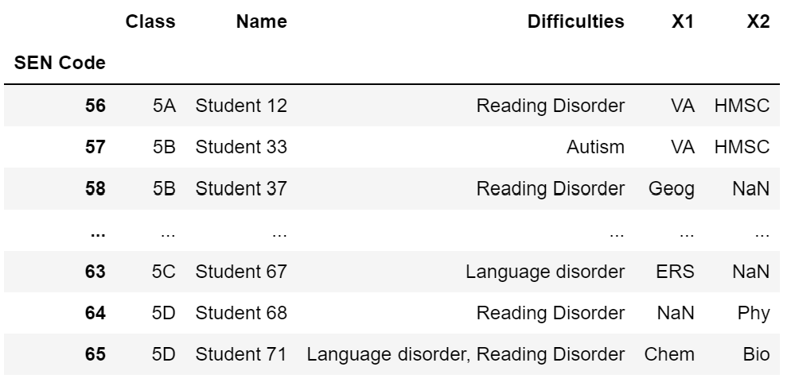
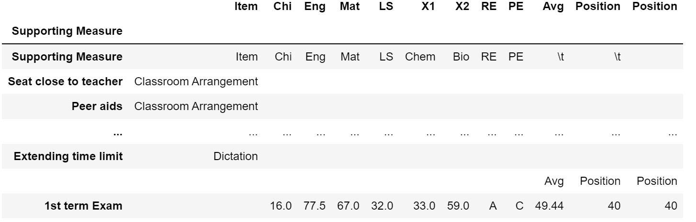
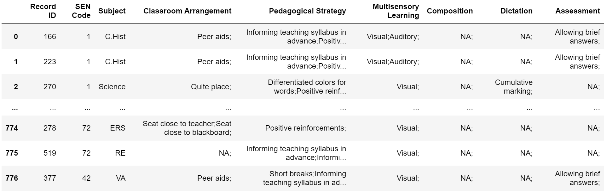
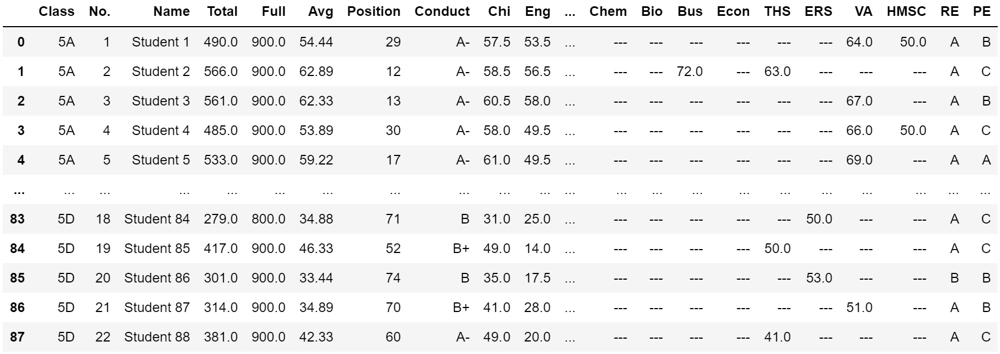

# Automating Documentation of Supporting Measures for Students with Diverse Needs

## Introduction
This project aim to help a school to generate a record sheet of the supporting measures conducted on each individual student with special education need(s) in a specified academic year.
<br/>
Since there are more than 4 000 supporting measures conducted on about 70 students in the year, filling in the record sheets manually would be a time-consuming job. Automating the documentation progress could hugely increase the productivity.
<br/>
<br/>
A record sheet generated should contain the following items:
- a filename in the format of "Class Student Name.docx"
- student name stated in appropriate place
- class stated in appropriate place
- learning difficulties stated in appropriate place
- the one or two elective subject(s) taken by the student stated in appropriate place
- ticks indicating the supporting measures conducted in specified subjects
- student's scores in each subject in 1st term exam
- student's average score in 1st term exam
- student's form position in 1st term exam
<br/>

The necessary information are stored in different excel files:
- Students_Info.xlsx
- Supporting_Measures.xlsx
- Exam_Scores.xlsx

<br/>
Note that all raw data in this demonstration are anoymized and modified in order to protect students and the school's privacy.
<br/>
<br/>

## Codes

Install python-docx and import the necessary packages to Python.

```python
!pip install python-docx
from docx import Document
import pandas as pd
import numpy as np
```
<br/>
Read students' information from the excel file. Convert it into a dataframe and clean it.

```python
#Getting students' info
info = pd.DataFrame(pd.read_excel('Students_Info.xlsx'))

#Clean info dataframe
info.rename(columns={'SEN\nCode':'SEN Code'}, inplace=True)
info['SEN Code'] = info['SEN Code'].astype(int)

#Set index
info.set_index(['SEN Code'], inplace=True)
```

<br/>
Read the template file. Convert all tables into one dataframe and clean it.

```python
#Read the template file
doc = Document('template_s5.docx')

#Convert tables into one dataframe
table_list = []
for table in doc.tables:
    data = [[cell.text for cell in row.cells] for row in table.rows]
    table_list.append(pd.DataFrame(data))
df = pd.concat(table_list)

#Set header
df.columns = ['Item', 'Supporting Measure', 'Chi', 'Eng', 'Mat', 'LS', 'X1', 'X2', 'RE', 'PE', 'Avg', 'Position', 'Position']

#Clean the dataframe
df['Item'] = df['Item'].str.strip()
df['Supporting Measure'] = df['Supporting Measure'].str.strip()

#Set index
df.set_index('Supporting Measure', inplace=True)
```

<br/>
Get the list of items of supporting measures.

```python
items = []
for item in df['Item'].unique():
    if item not in ['Item', '']:
        item = item.replace('\n', ' ')
        items.append(item)
```
<br/>
Read the conducted students' supports measures. Convert the data into one dataframe and clean it.

```python
#Read related columns in students' supports excel
supports = pd.DataFrame(pd.read_excel('Supporting_Measures.xlsx'))

#Clean students' supports dataframe
supports[['Record ID', 'SEN Code']] = supports[['Record ID', 'SEN Code']].astype(int)

#Clean subject names
for i in range(0,supports.shape[0]):
    subj = supports['Subject'][i]
    subj = subj.replace(';', '')
    subj = subj.replace(' ', '')
    if subj == 'Math':
        subj = 'Mat'
    supports.loc[i,'Subject'] = subj
```

<br/>

Check whether the template includes all types of the supporting measures conducted.

```python
#Get unique elements of students' supporting measures
unique_supports = []
for item in items:
    for i in range(0, supports.shape[0]):
        temp = supports.loc[i, item].split(';')
        del temp[-1]
        for sup in temp:
            sup = sup.strip()
            if sup not in unique_supports:
                unique_supports.append(sup)

#Check the completeness of the template file
check = 0
for sup in unique_supports:
    if sup not in df.index and sup != 'NA':
        print(sup + ' need to be added to the template.')
        check += 1
if check == 0:
    print('The measures in the template are complete.')
```
<br/>

Read the exam scores. Convert the records into one dataframe and clean it.

```python
#Read Exam Scores
S5marks_Exam = pd.read_excel('Exam_Scores.xlsx', sheet_name='S.5')
S5marks_Exam = pd.DataFrame(S5marks_Exam)

#Clean S5 Exam marks dataframe
S5marks_Exam[['No.', 'Pos']] = S5marks_Exam[['No.', 'Pos']].astype(int)

#Keep scores for Chi, Eng, Mat with full marks of 100
S5marks_Exam.drop(columns=['Chi', 'Eng', 'Math'], axis=1, inplace=True)
S5marks_Exam.rename(columns={'Chi(100)':'Chi', 'Eng(100)':'Eng', 'Math(100)':'Mat', 'Average':'Avg', 'Pos':'Position'}, inplace=True) #Template uses 'Mat' to stand for Math
```

<br/>

After converting all data into readable dataframes and cleaning them, we can start generate the record sheets.

```python
#Generate individual student supports form
for code in info.index: 
    sup = supports[supports['SEN Code'] == code].copy()
    sup = sup.reset_index(drop=True)
    df_ind = df.copy()
    rows = sup.shape[0]

#Write students' electives to columns
    if isinstance(info.loc[code, 'X1'], str) and isinstance(info.loc[code, 'X2'], str):
        X1 = info.loc[code, 'X1']
        X2 = info.loc[code, 'X2']
        df_ind.rename(columns={'X1':X1, 'X2':X2}, inplace=True)
        df_ind.loc['Supporting Measure',X1] = X1
        df_ind.loc['Supporting Measure',X2] = X2
    elif isinstance(info.loc[code, 'X1'], str):
        df_ind = df_ind[['Item', 'Chi', 'Eng', 'Mat', 'LS', 'X1', 'RE', 'PE', 'X2', 'Avg', 'Position']]
        X1 = info.loc[code, 'X1']
        df_ind.rename(columns={'X1':X1, 'X2':' '}, inplace=True)
        df_ind.loc['Supporting Measure',X1] = X1
    elif isinstance(info.loc[code, 'X2'], str):
        df_ind = df_ind[['Item', 'Chi', 'Eng', 'Mat', 'LS', 'X2', 'RE', 'PE', 'X1', 'Avg', 'Position']]
        X2 = info.loc[code, 'X2']
        df_ind.rename(columns={'X1':' ', 'X2':X2}, inplace=True)
        df_ind.loc['Supporting Measure',X2] = X2
    else:
        df_ind = df_ind[['Item', 'Chi', 'Eng', 'Mat', 'LS', 'RE', 'PE', 'X1', 'X2', 'Avg', 'Position']]
        df_ind.rename(columns={'X1':' ', 'X2':' '}, inplace=True)

#Put ticks in the boxes of corresponding measures adopted
    for item in items:
        for r in range(0,rows):
            item_sup = sup.loc[r,item].split(';')
            del item_sup[-1]
            for i in range(0, len(item_sup)):
                if item_sup[i] != 'NA' and sup['Subject'][r] in df_ind.columns:
                    item_sup[i] = item_sup[i].strip()
                    df_ind.loc[item_sup[i],sup['Subject'][r]] = 'v'

#Fill in marks
    name = info['Name'][code]
    gets = df_ind.columns
    mark_Exam = S5marks_Exam[S5marks_Exam['Name'] == name].copy()
    mark_Exam = mark_Exam.reset_index(drop=True)
    for get in gets:
        if get in mark_Exam.columns:
            df_ind.loc['1st term Exam', get] = str(mark_Exam.loc[0,get])
        
#Remove index
    df_ind.reset_index(inplace=True)
    df_ind.set_index('Item', inplace=True)
    df_ind.reset_index(inplace=True)
    df_ind.columns = range(0,df_ind.shape[1])
    
#Generate doc
    content = doc.paragraphs
    content[4].text = 'Name: ' + name + '\t\t' + 'Class: ' + info['Class'][code]
    content[5].text = 'Difficulties: ' + info['Difficulties'][code]
    for i in range(0, df_ind.shape[0]):
        for j in range(0, df_ind.shape[1]):
            table.cell(i,j).text = df_ind.iloc[i,j]
    filename = info['Class'][code] + ' ' + name
    doc.save(filename + '.docx')
    print(filename + ' done!')
print('S5 all done!')
```

